# Object Orientation Estimation from Classical Image Features

Estimates a rigid object's 3D orientation, as a quaternion, from an RGB image and its binary segmentation mask — using hand-engineered geometric and texture descriptors instead of a CNN, so the models stay small enough for microcontroller-class hardware.

## Overview

Recent 6D pose methods rely on CNNs over dense correspondences or keypoints, costing significant compute at inference time. This project tests a cheaper alternative: extract classical descriptors from a segmentation mask an edge device already produces, and regress orientation from them directly — a near-free add-on to existing segmentation, not a CNN-accuracy contender. Evaluation uses one textureless, asymmetric LINEMOD/BOP object ("cam"), with no translation, scale, or illumination variation, isolating whether the features carry orientation information at all. Linear regression and a decision tree were the original baselines; the repo now also covers random forest, SVM (RBF/polynomial), an MLP, and a feature-quantization + C-export pipeline for embedded inference. Work in progress, covering one object in a simplified synthetic scenario so far.

## Key Technical Highlights

- 28 features in three groups: silhouette shape (perimeter compactness, bounding-box aspect ratio, eccentricity), 2D orientation (centroid-offset distance/angle as sin-cos, principal-axis angle as sin-cos, a 12-bin HOG over the mask's external contour), and texture (7 log-transformed Hu moments on the background-removed grayscale object).
- Quaternion output, re-normalized post-prediction, scored with a geodesic angular error (2·arccos|q·q̂|) resolving the quaternion sign ambiguity — used for all model comparisons.
- Five regressor families benchmarked on an identical 70/30 split and 10-fold CV grid search (see Results).
- Decision tree exported per quaternion component to inline C via `emlearn` for on-device inference; a 2–16-bit input-quantization sweep found 4-bit quantization gives the lowest validation error — counter to the assumption that more bits is always better.
- Contour approximation, ellipse fitting, and hierarchical hole-counting built directly on OpenCV primitives rather than a higher-level descriptor library, keeping the extractor light enough to run alongside the mask model.
- Pearson correlation flagged a >0.8 correlation between the 1st and 4th Hu moments, noted as a caveat for tree-based feature-importance interpretation.

## Research / Technical Context

Data is the BOP-distributed synthetic LINEMOD subset (Hinterstoisser et al., 2013): 1313 RGB images with binary masks, restricted to the asymmetric "cam" object so every orientation component must be estimated correctly. Hyperparameters are chosen by grid search with 10-fold CV minimizing geodesic RMSE; models are compared by mean/RMSE geodesic error and hit-rate-vs-tolerance curves. This is the second installment of a course research series (ELE0318, PPGEE-UFRGS); the first established the linear and decision-tree baselines, with neural networks and CNNs planned next.

## Tech Stack

- **Language:** Python 3.12
- **ML/CV:** scikit-learn (decision tree, random forest, SVR, MLP), OpenCV, NumPy, SciPy, pandas
- **Embedded/Deployment:** `emlearn` (sklearn → inline C), manual uint8/16/32 feature quantization
- **Tools:** matplotlib, seaborn, openpyxl, Jupyter
- **Hardware target:** microcontroller-class device (TinyML / ESP32-class)

## Results

Geodesic angular error of the five models developed for the "cam" object, identical 70/30 split (from the paper, Table 9):

| Metric | Linear Reg. | Decision Tree | Random Forest | SVM (RBF) | SVM (Poly) |
|---|---|---|---|---|---|
| Mean – train [°] | 37.4 | 2.3 | 2.4 | 2.2 | 2.3 |
| Mean – test [°] | 38.8 | 9.6 | 7.0 | **5.3** | 6.1 |
| RMSE – train [°] | 47.9 | 2.6 | 3.3 | 9.4 | 9.6 |
| RMSE – test [°] | 49.4 | 17.6 | 11.8 | **8.9** | 9.1 |
| 60% hit rate – train [°] | — | 2.5 | 2.0 | <1\* | <1\* |
| 60% hit rate – test [°] | — | 7.4 | 5.5 | **4.5** | 5.2 |
| 80% hit rate – train [°] | — | 3.0 | 3.1 | 1.5 | 1.5 |
| 80% hit rate – test [°] | — | 11.0 | 9.0 | **7.0** | 8.0 |

\* hit rate already exceeds 60% at the minimum evaluated threshold of 1°.

SVM (RBF) has the lowest bias and variance overall; random forest has low bias but intermediate variance; the decision tree has low bias but is the most overfit (high variance); linear regression is the only model with high bias (underfitting).

Below, for each model: the geodesic-error histogram on the training set, on the test set, and the hit-rate-vs-threshold curve (source images under `models/object_4/<model>_70_30/performance/`).

**Linear regression** — baseline, underfits both sets.

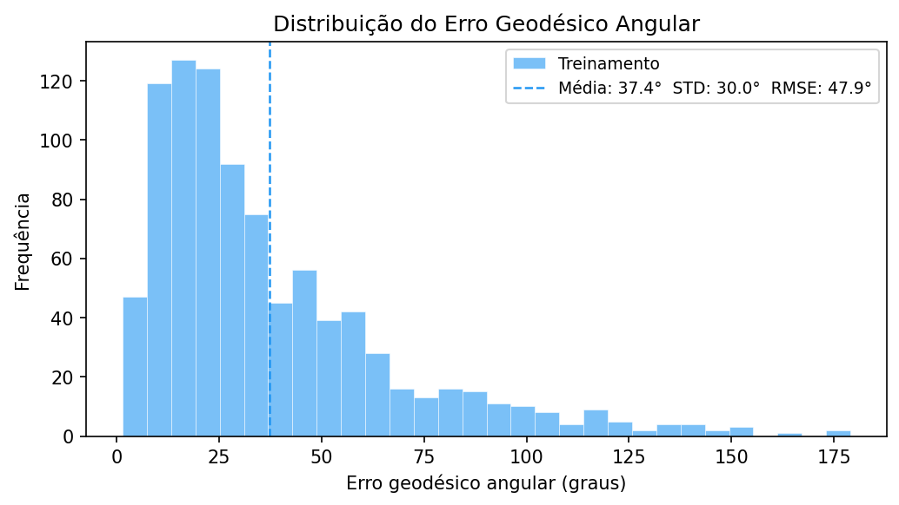
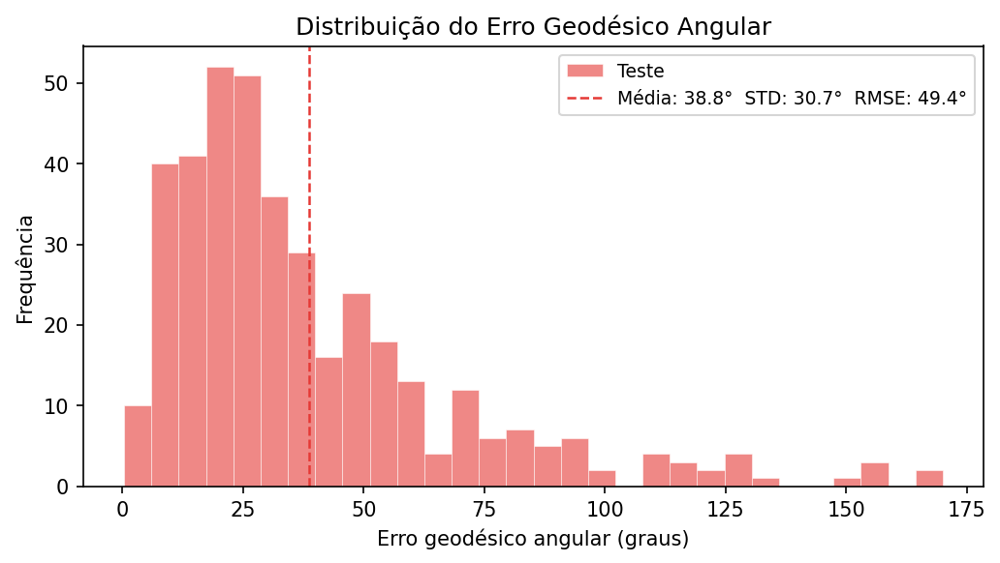
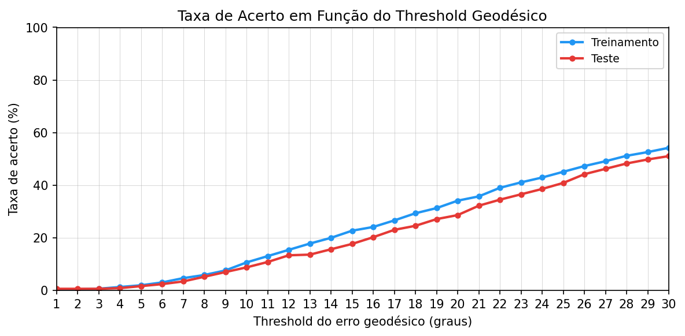

**Decision tree** (post-pruned) — low train error, large train/test gap (overfitting).

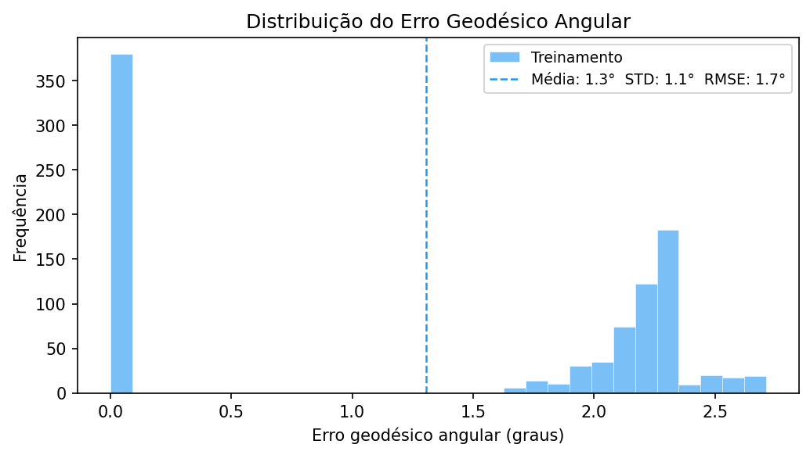
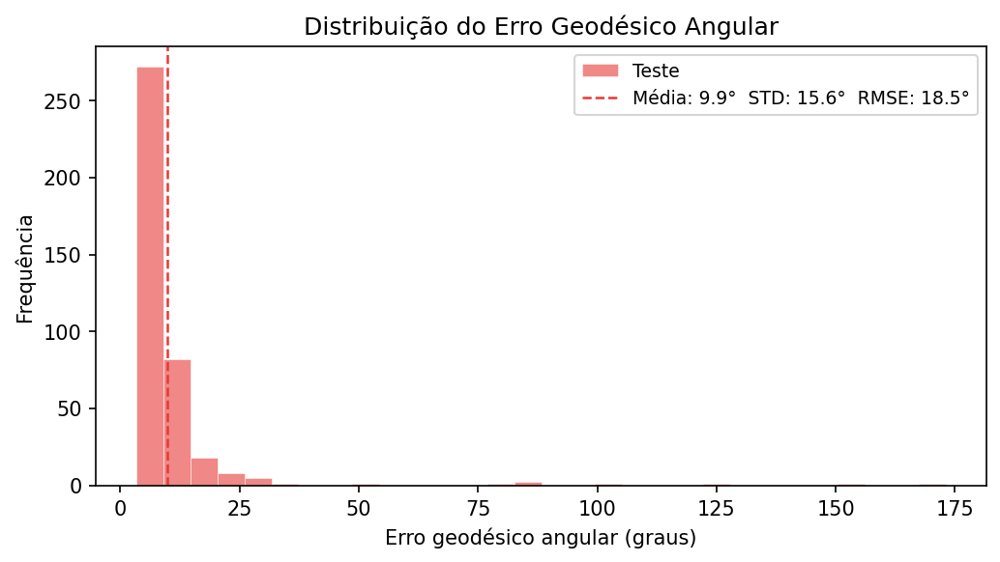
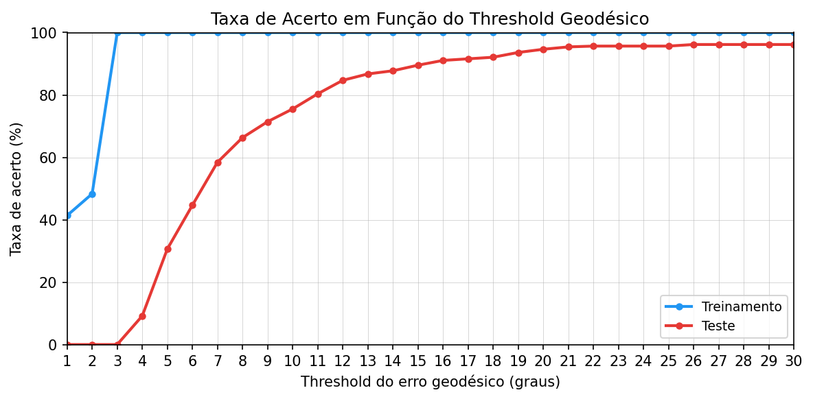

**Random forest** — similar train fit to the decision tree, smaller train/test gap.

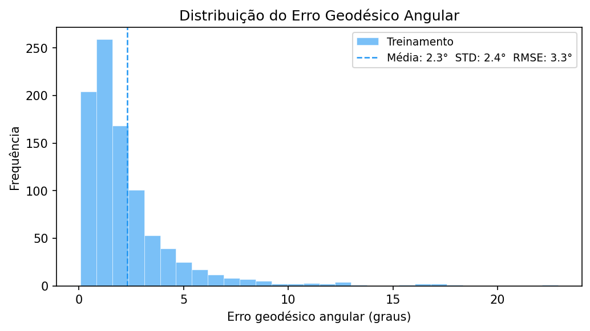
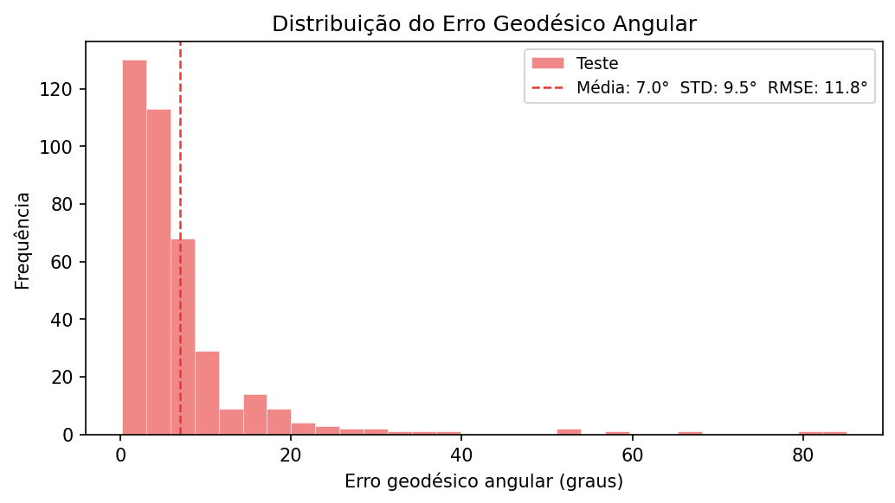
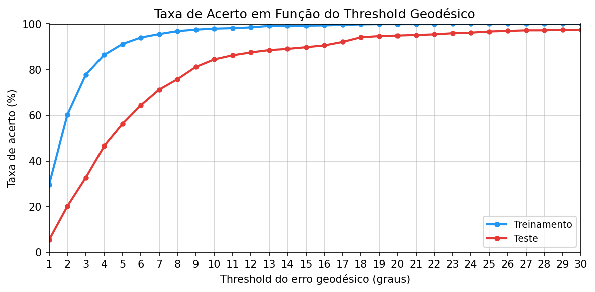

**SVM (RBF kernel)** — best generalization of the five.

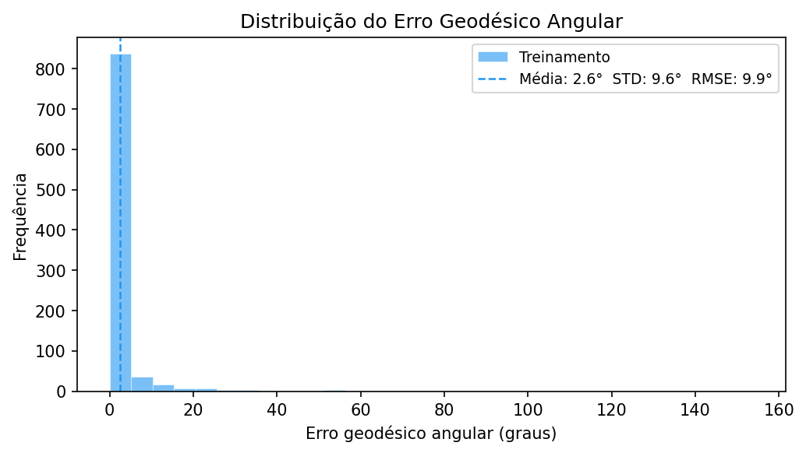
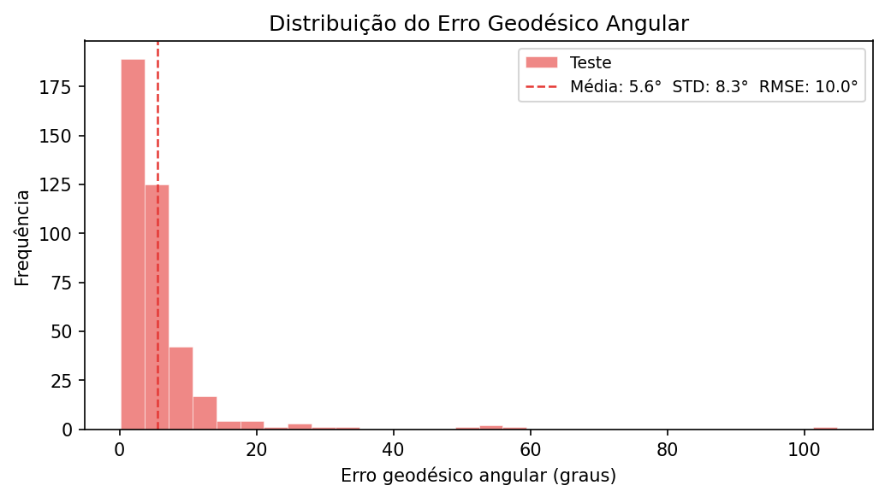
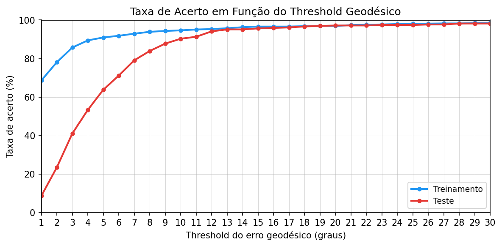

**SVM (polynomial kernel)** — marginally behind RBF on the test set.

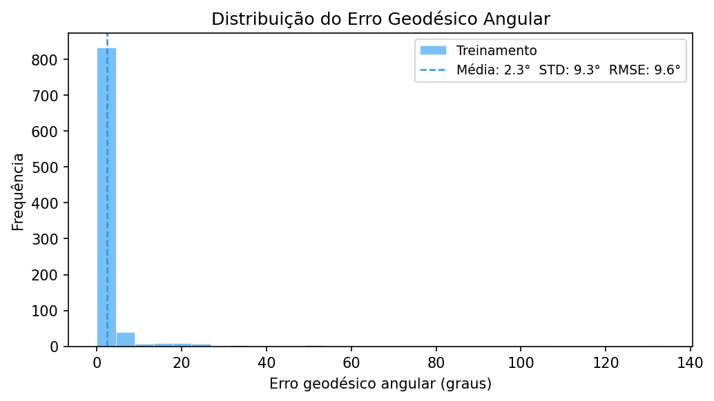
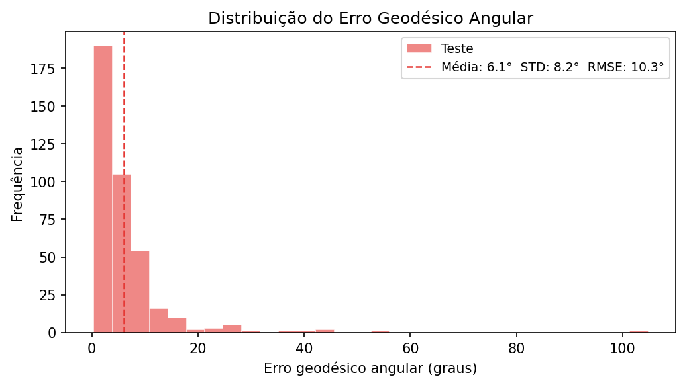
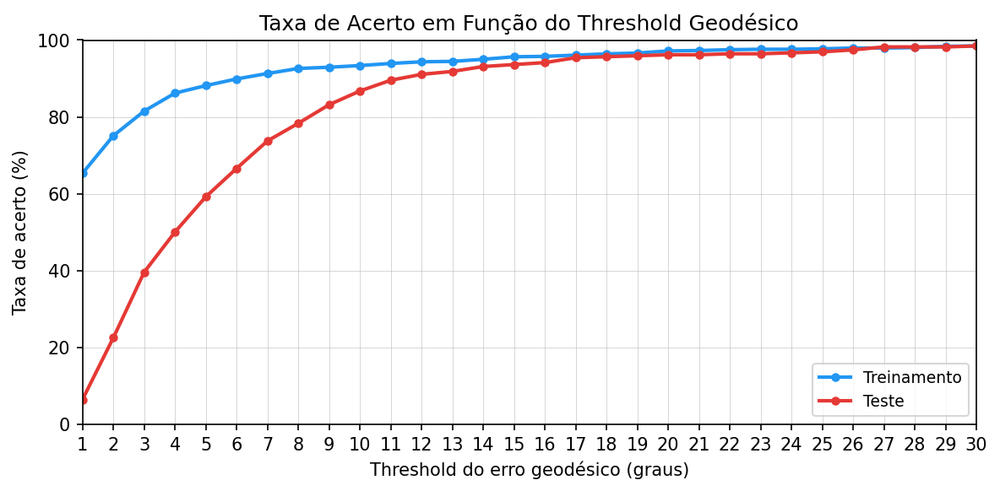

### Beyond the published comparison

- MLP (preliminary, not in the table above): ~7.9° mean / 13.6° RMSE on test.
- Decision tree input-feature quantization: a 2–16-bit sweep found 4-bit quantization gives the lowest validation RMSE (~19°), counter to the assumption that more bits is always better.

All numbers are preliminary — one object, controlled synthetic scenario — not evidence the approach generalizes to multiple objects or real imaging conditions.

## Related Publication

- `Project_paper_1.pdf` — "Estimativa de orientação de objetos através de características extraídas da imagem" (Caetani, 2026, UFRGS/PPGEE). Compares linear regression, decision tree, random forest, and SVM (RBF/polynomial) for quaternion orientation regression on the pipeline above, using geodesic angular error as the primary metric.
